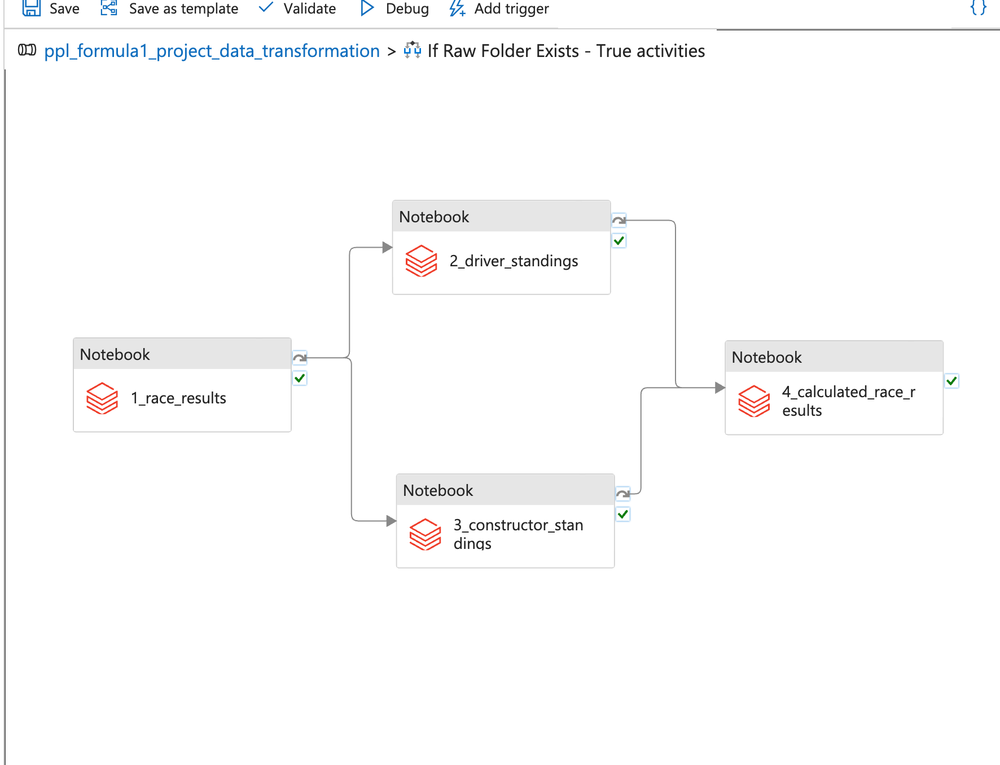
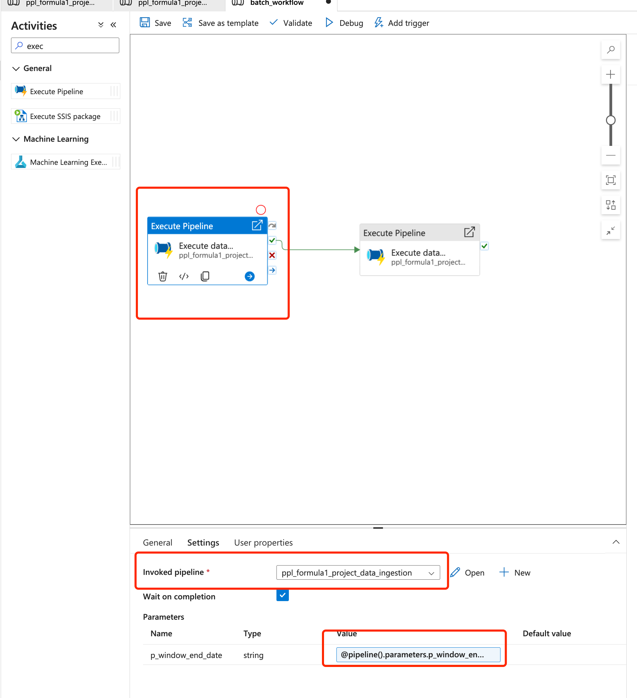
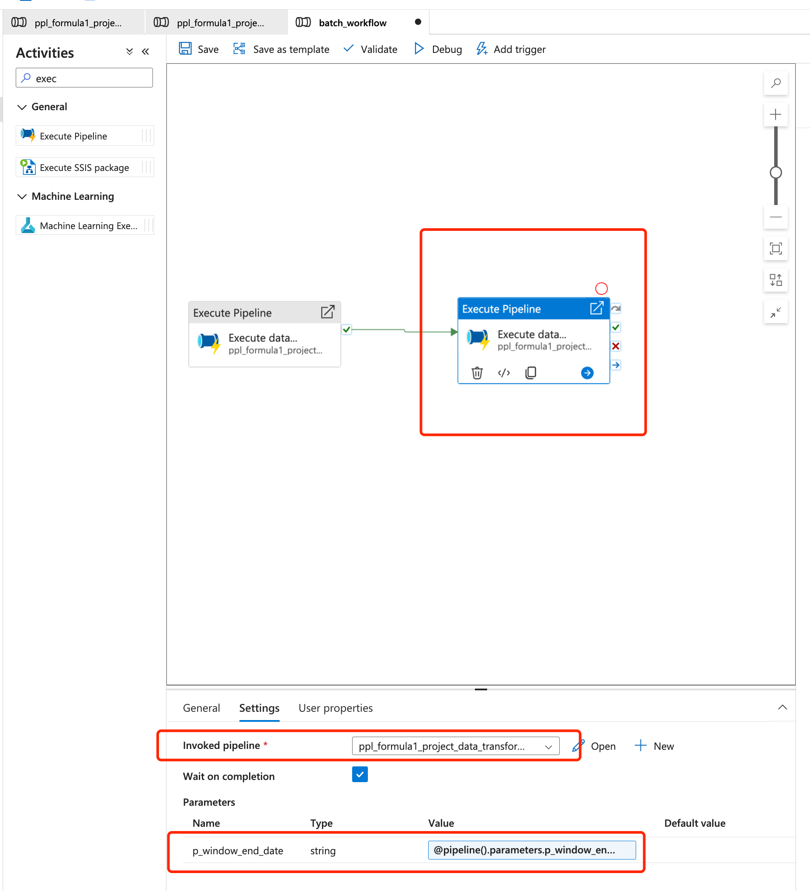
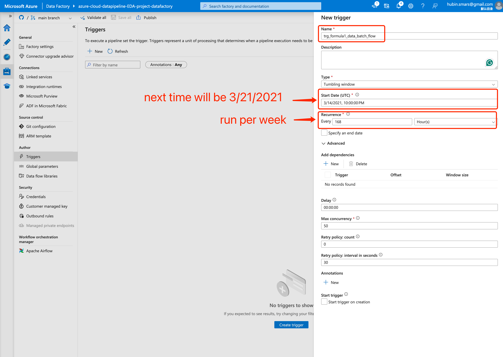

# Azure Data Factory Creation and Configuration (Scheduler)

## 1. Create data ingestion pipeline 

Create an Azure Data Factory resource in the azure subscription, 

In the databrick workspace resource, add `contributor` role for data factory to connect the databrick.

create Notebook component (connect to the databrick notebook) in the ADF.

finish `Azure Databricks` and `Settings`.

duplicate them and link one by one.

## 2. create metadata check for `raw` layer

To make the pipeline robust, we should check out if the dataset is exists before we go start our data ingestion and transformation pipeline. Thus we are going to use `get metadata` service to realize it.

below is the `get metadata` setting

below is the `dataset` connection configuration of `get metadata` setting 

below is the if-condition activity expression

below is the if-True activity of the if-condition activity, we should copy paste previous workflow to this part.

## 2. create the data transform pipeline

Similar process, let us create the transform pipeline. Below is some different point screenshot.

## 3. create execute pipeline

we could use the `execute pipeline` activity to connect the above 2 pipeline.

## 4. create ADF trigger

we could use ADF trigger to launch the data pipeline in the certain date or time.

Below is showing how to create the trigger

add trigger in our pipeline `batch_workflow`, using `@trigger().outputs.windowEndTime`

