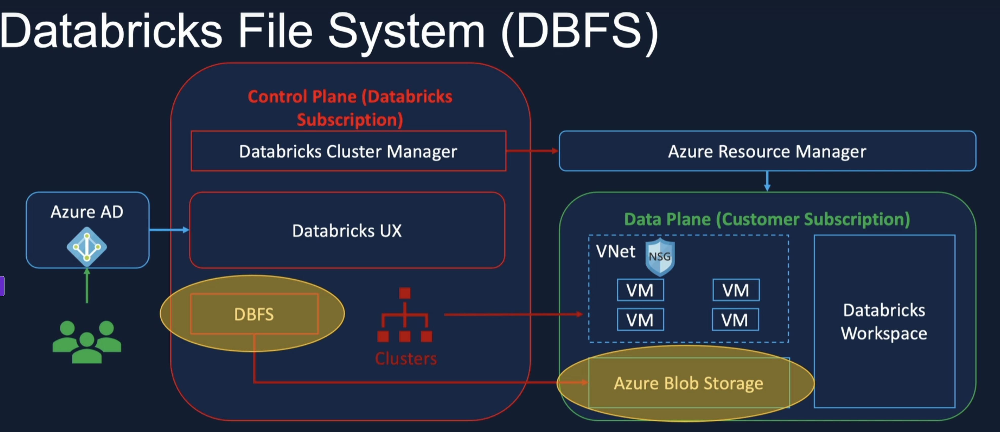
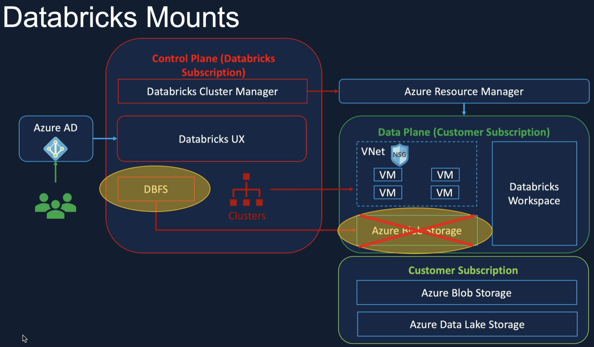

# Mounting Data Lake Container to Databricks

### Mounting to DBFS Root (Default Blob Storage) 



```python
# list the root direcotry
display(dbutils.fs.ls('/'))

# list the FileStore (Mount FileStore)
display(dbutils.fs.ls('/FileStore'))

# read the certain file
# display(spark.read.csv('dbfs:/FileStore/circuits.csv'))
display(spark.read.csv('/FileStore/circuits.csv'))
```

### Mount to external Azure Delta Lake Storage



Databricks Notebook

```python
# Databricks notebook source
# MAGIC %md
# MAGIC ### Mount Azure Data Lake using Service Principal
# MAGIC #### Steps to follow
# MAGIC 1. Get client_id, tenant_id and client_secret from key vault
# MAGIC 2. Set Spark Config with App/ Client Id, Directory/ Tenant Id & Secret
# MAGIC 3. Call file system utlity mount to mount the storage
# MAGIC 4. Explore other file system utlities related to mount (list all mounts, unmount)

# COMMAND ----------

def mount_adls(storage_account_name, container_name):
    # Get secrets from Key Vault
    client_id = dbutils.secrets.get(scope = 'formula1-scope', key = 'formula1-app-client-id')
    tenant_id = dbutils.secrets.get(scope = 'formula1-scope', key = 'formula1-app-tenant-id')
    client_secret = dbutils.secrets.get(scope = 'formula1-scope', key = 'formula1-app-client-secret')
    
    # Set spark configurations
    configs = {"fs.azure.account.auth.type": "OAuth",
              "fs.azure.account.oauth.provider.type": "org.apache.hadoop.fs.azurebfs.oauth2.ClientCredsTokenProvider",
              "fs.azure.account.oauth2.client.id": client_id,
              "fs.azure.account.oauth2.client.secret": client_secret,
              "fs.azure.account.oauth2.client.endpoint": f"https://login.microsoftonline.com/{tenant_id}/oauth2/token"}
    
    # Unmount the mount point if it already exists
    if any(mount.mountPoint == f"/mnt/{storage_account_name}/{container_name}" for mount in dbutils.fs.mounts()):
        dbutils.fs.unmount(f"/mnt/{storage_account_name}/{container_name}")
    
    # Mount the storage account container
    dbutils.fs.mount(
      source = f"abfss://{container_name}@{storage_account_name}.dfs.core.windows.net/",
      mount_point = f"/mnt/{storage_account_name}/{container_name}",
      extra_configs = configs)
    
    display(dbutils.fs.mounts())

# COMMAND ----------

# MAGIC %md
# MAGIC ##### Mount Raw Container

# COMMAND ----------

mount_adls('formula1dl', 'raw')

# COMMAND ----------

mount_adls('formula1dl', 'processed')

# COMMAND ----------

mount_adls('formula1dl', 'presentation')

# COMMAND ----------
```

