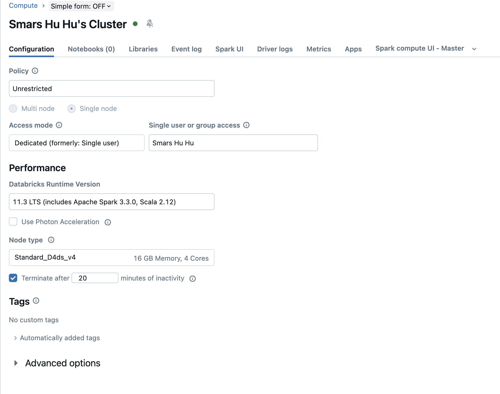
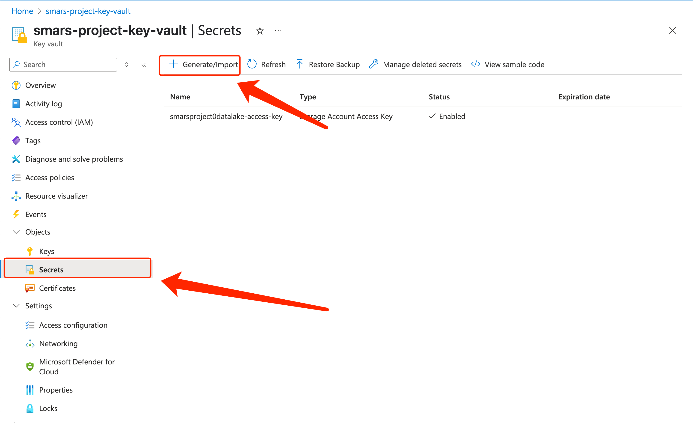
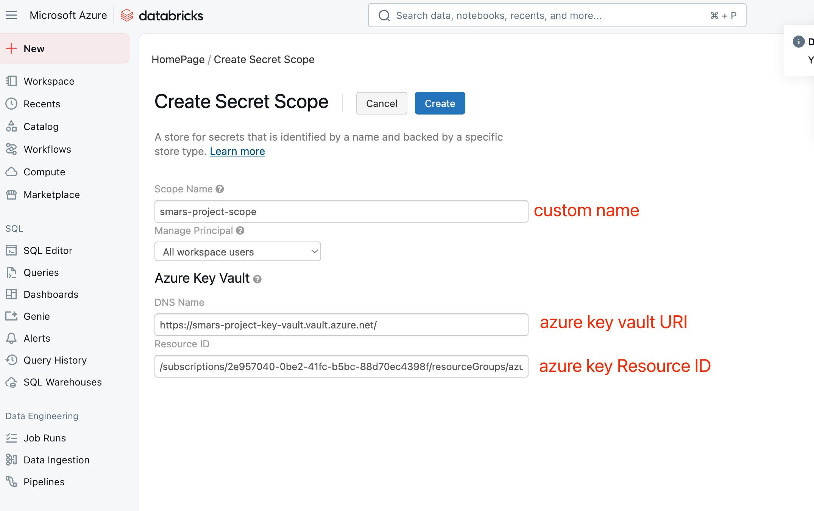
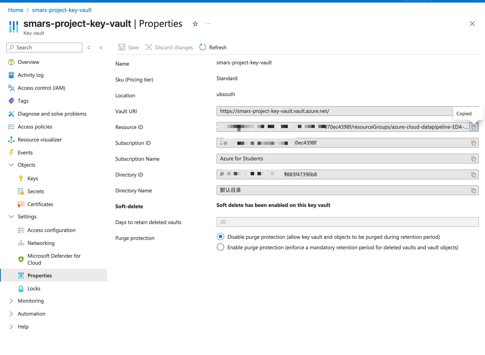
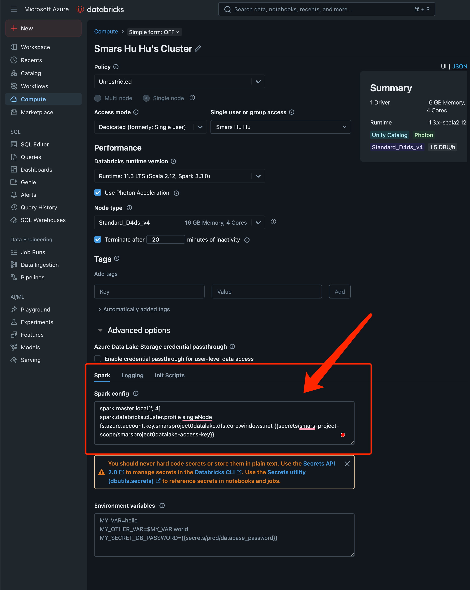

# 代码使用说明

## 建立Azure Databricks环境

1. Azure上创建Storage Account（ADLS gen2 数据湖存储）


2. Azure上创建Databrick Workspace + Compute Cluster （notebook + Spark计算）

并创建Compute Cluster


3. Azure上创建Key Vault（存储access key）

并创建Secrets


4. Databrick workspace里创建SecretScope， `HomepageURL` + `#secrets/createScope` 如下
例如我的homepage URL为
```bash
https://adb-3262920291712130.10.azuredatabricks.net/?o=3262920291712130
```
那么就加上`#secrets/createScope` 变成下面的URL
```bash
https://adb-3262920291712130.10.azuredatabricks.net/?o=3262920291712130#secrets/createScope
```

然后输入


获取Vault URI 和 Resource ID：


5. Databricks Cluster 添加 Secrets Spark Configs


Spark Config 加入下面这个
```bash
fs.azure.account.key.smarsproject0datalake.dfs.core.windows.net {{secrets/smars-project-scope/smarsproject0datalake-access-key}}
```
注意：
smarsproject0datalake 为我的Storage Account Name
smars-project-scope 为我在workspaceURL#secrets/createScope里创建的Scope Name
smarsproject0datalake-access-key 为我的Key Vault里创建的secrets name


## Data Lake导入数据

### Dataset
查看项目的[dataset](../dataset/)

## Databricks Notebook脚本导入worksapce