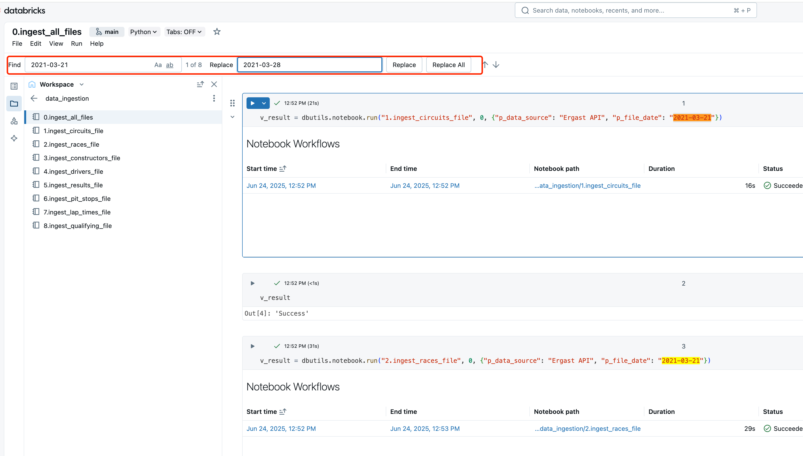
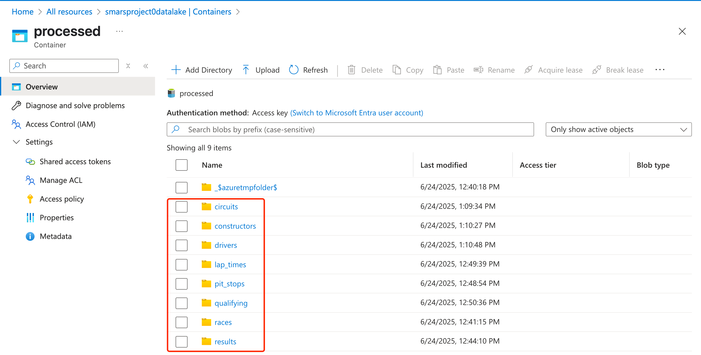

# 代码使用说明

## Environment Setup for Azure Databricks

1. Azure上创建Storage Account（ADLS gen2 数据湖存储）

create data storage containers: `raw`, `processed`, `presentation` under the data lake account


2. Azure上创建Databrick Workspace + Compute Cluster （notebook + Spark计算）

并创建Compute Cluster


3. Azure上创建Key Vault（存储access key）

并创建Secrets


4. Databrick workspace里创建SecretScope， `HomepageURL` + `#secrets/createScope` 如下

通过下面方法进入Scope Create 页面

例如我的homepage URL为
```bash
https://adb-3262920291712130.10.azuredatabricks.net/?o=3262920291712130
```
那么就加上`#secrets/createScope` 变成下面的URL
```bash
https://adb-3262920291712130.10.azuredatabricks.net/?o=3262920291712130#secrets/createScope
```

然后输入


获取Vault URI 和 Resource ID：


5. Databricks Cluster 添加 Secrets Spark Configs


Spark Config 加入下面这个
```bash
fs.azure.account.key.smarsproject0datalake.blob.core.windows.net {{secrets/smars-project-scope/smarsproject0datalake-access-key}}
```
注意：
- smarsproject0datalake 为我的Storage Account Name
- smars-project-scope 为我在workspaceURL#secrets/createScope里创建的Scope Name
- smarsproject0datalake-access-key 为我的Key Vault里创建的secrets name

## Databricks Notebook 脚本导入 Worksapce

## Mount Data Lake Container to Databricks File System (DBFS)

click **"run all"** under the notebooks `src/utils/mount_adls_storage` web user interface.


By run python command: `display(dbutils.fs.mounts())`
As we can see, below three mount points have been added.

- `/mnt/smarsprojectOdatalake/raw`
- `/mnt/smarsprojectOdatalake/processed`
- `/mnt/smarsprojectOdatalake/presentation`

Also, you can see the DBFS in our databricks workspace web UI.


## Import data to Data Lake

### Dataset

check out [dataset](../dataset/) of the project.

### Import dataset to data lake container.

enter into `raw` container, and then click the `upload` and drop all dataset files to this container.


## Data Modelling (Create databases and tables)

By running scripts under `src/data_modeling` to create databases and tables schema in the DBFS.


## Data Ingestion (layer `raw` to layer `processed`) & Data Transformation (layer `processed` to `presentation`) - incremental load workflow

By running script `/src/data_ingestion/0.ingest_all_files` and `/src/data_transformation/0.transform_all_files`

change the `p_file_date` every time in terms of different date:
- `2021-03-21`
- `2021-03-28`
- `2021-04-18`

to realize the incremental load logic.

**please note that combine the operation of ingestion(1st) and transformation(2nd) each time for single same date.**



so, you are supposed to run 2*3 times at least to get the incremental loading process done.

Once done, check out the `processed` layer and `presentation` in the ADLS.




**if you want to refresh `processed` or `presentation` layer, you could run the script `src/utils/drop_tables_processed` or `src/utils/drop_tables_transformation`, which is going to drop the databases `processed` or `transformation` and recreate it. (Empty all the metadata)**

## Delete Compute Resources

After ingestion and transformation, basically core analytic data are loaded to `presentation` layer, now we could delete compute resources to save cost budget.

