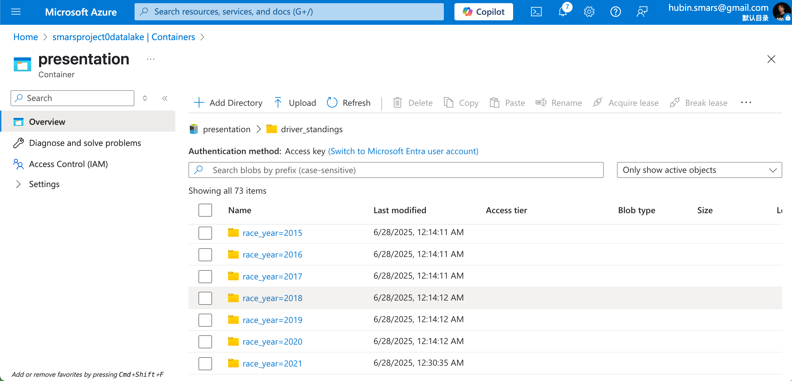

# 代码使用说明

## Content 

- [Azure Databrick Enviroment Setup and Restore]()
    - [Environment Setup for Azure Databricks]()
    - [Databricks Notebook 脚本导入 Worksapce]()
    - [Mount Data Lake Container to Databricks File System (DBFS)]()
    - [Import data to Data Lake (RAW layer)]()
    - [Data Modelling (Create databases and tables)]()
    - [Data Restore in the ADLS]()
    - [Azure Data Factory Source Deployment]()
    - [Delete Compute Resources]()

- [Tableau BI]()

## Azure Databrick Enviroment Setup and Restore

### Environment Setup for Azure Databricks

1. Azure上创建Storage Account（ADLS gen2 数据湖存储）

create data storage containers: `raw`, `processed`, `presentation` under the data lake account


2. Azure上创建Databrick Workspace + Compute Cluster （notebook + Spark计算）

并创建Compute Cluster


3. Azure上创建Key Vault（存储access key）

并创建Secrets


4. Databrick workspace里创建SecretScope， `HomepageURL` + `#secrets/createScope` 如下

通过下面方法进入Scope Create 页面

例如我的homepage URL为
```bash
https://adb-3262920291712130.10.azuredatabricks.net/?o=3262920291712130
```
那么就加上`#secrets/createScope` 变成下面的URL
```bash
https://adb-3262920291712130.10.azuredatabricks.net/?o=3262920291712130#secrets/createScope
```

然后输入


获取Vault URI 和 Resource ID：


5. Databricks Cluster 添加 Secrets Spark Configs


Spark Config 加入下面这个
```bash
fs.azure.account.key.smarsproject0datalake.blob.core.windows.net {{secrets/smars-project-scope/smarsproject0datalake-access-key}}
```
注意：
- smarsproject0datalake 为我的Storage Account Name
- smars-project-scope 为我在workspaceURL#secrets/createScope里创建的Scope Name
- smarsproject0datalake-access-key 为我的Key Vault里创建的secrets name

### Databricks Notebook 脚本导入 Worksapce

### Mount Data Lake Container to Databricks File System (DBFS)

click **"run all"** under the notebooks `src/utils/mount_adls_storage` web user interface.


By run python command: `display(dbutils.fs.mounts())`
As we can see, below three mount points have been added.

- `/mnt/smarsprojectOdatalake/raw`
- `/mnt/smarsprojectOdatalake/processed`
- `/mnt/smarsprojectOdatalake/presentation`

Also, you can see the DBFS in our databricks workspace web UI.


### Import data to Data Lake (RAW layer)

#### Dataset

check out [dataset](../dataset/) of the project.

#### Import dataset to data lake container.

enter into `raw` container, and then click the `upload` and drop all dataset files to this container.


### Data Modelling (Create databases and tables)

By running scripts under `src/data_modeling` to create databases and tables schema in the DBFS.


### Data Restore in the ADLS

This step is going to run a batch job to finish data ingestion (layer `raw` to layer `processed`) & data transformation (layer `processed` to `presentation`) by incremental load workflow, and then restore the same data in the ADLS as mine.

By running script `/src/utils/restore_data_in_ADLS` to launch the one-click data ingestion and transfortion in terms of date.

Once done, check out the `processed` layer and `presentation` layer in the ADLS container.




**if you want to refresh `processed` or `presentation` layer, you could run the script `src/data_modeling/processed_layer/drop_tables_processed` or `src/data_modeling/presentation_layer/drop_tables_transformation`, which is going to drop the databases `processed` or `transformation` and recreate it. (Empty all the metadata)**


### Azure Data Factory Source Deployment (using ARM Template)

To get the components in the ADF, we should import the ARM Template to restore the ADF resource with components created inside.


#### 1. Import ARM Template in the ADF Source Control


load the ARM template for ADF. (`/devops/ADF_src/ARMTemplateForFactory.json`)


add storage account key in the instance details and then click `Review+create`


### Delete Compute Resources

After ingestion and transformation, basically core analytic data are loaded to `presentation` layer, now we could delete compute resources to save cost budget.


## Tableau BI

