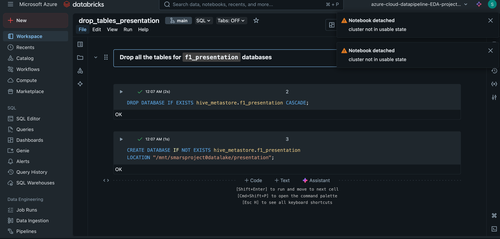

# Source Code Instruction

## Content 

- [Azure Databrick Enviroment Setup and Restore]()

    - [Environment Setup for Azure Databricks](https://github.com/Smars-Bin-Hu/azure-cloud-datapipeline-EDA/tree/main/src#environment-setup-for-azure-databricks)
    - [Load Databricks Notebook to the Worksapce](https://github.com/Smars-Bin-Hu/azure-cloud-datapipeline-EDA/tree/main/src#load-databricks-notebook--to-the-worksapce)
    - [Mount Data Lake Container to Databricks File System (DBFS)](https://github.com/Smars-Bin-Hu/azure-cloud-datapipeline-EDA/tree/main/src#mount-data-lake-container-to-databricks-file-system-dbfs)
    - [Import data to Data Lake (RAW layer)](https://github.com/Smars-Bin-Hu/azure-cloud-datapipeline-EDA/tree/main/src#import-data-to-data-lake-raw-layer)
    - [Data Modelling (Create databases and tables)](https://github.com/Smars-Bin-Hu/azure-cloud-datapipeline-EDA/tree/main/src#data-modelling-create-databases-and-tables)
    - [Data Restore in the ADLS](https://github.com/Smars-Bin-Hu/azure-cloud-datapipeline-EDA/tree/main/src#data-restore-in-the-adls)
    - [Azure Data Factory Source Deployment (using ARM Template)](https://github.com/Smars-Bin-Hu/azure-cloud-datapipeline-EDA/tree/main/src#azure-data-factory-source-deployment-using-arm-template)
    - [Delete Compute Resources](https://github.com/Smars-Bin-Hu/azure-cloud-datapipeline-EDA/tree/main/src#delete-compute-resources)

- [Data Visualization & EDA]()

    - [Data Visualization via Python](https://github.com/Smars-Bin-Hu/azure-cloud-datapipeline-EDA/blob/main/visualization/via_python/f1_presentation_analysis.ipynb)
    - [Data Visualization via Tableau BI](https://public.tableau.com/app/profile/smars.hu/viz/eda_visualization_on_formula1_racing/Dashboard1?publish=yes)
    - [EDA Paper](https://github.com/Smars-Bin-Hu/azure-cloud-datapipeline-EDA/blob/main/visualization/Final%20Project%20Paper.pdf)

## Azure Databrick Enviroment Setup and Restore

### Environment Setup for Azure Databricks

1. Create Storage Account on Azure（ADLS gen2 data lake storage）

create data storage containers: `raw`, `processed`, `presentation` under the data lake account


2. Create Databrick Workspace + Compute Cluster on Azure（notebook + Spark compute）and create Compute Cluster


3. Create Key Vault on Azure（for restoring access key）and create Secrets


4. Create SecretScope， `HomepageURL` + `#secrets/createScope` on Databrick workspace as below

**use below method to enter Scope Create page**

e.g. my homepage URL is 
```bash
https://adb-3262920291712130.10.azuredatabricks.net/?o=3262920291712130
```
then append `#secrets/createScope` and get the URL as below
```bash
https://adb-3262920291712130.10.azuredatabricks.net/?o=3262920291712130#secrets/createScope
```

Input


get Vault URI and Resource ID：


5. Databricks Cluster add Secrets Spark Configs


In the Spark Config add below:
```bash
fs.azure.account.key.smarsproject0datalake.blob.core.windows.net {{secrets/smars-project-scope/smarsproject0datalake-access-key}}
```
Note：
- `smarsproject0datalake` is my Storage Account Name.
- `smars-project-scope` is the Scope Name created in the `{workspaceURL}#secrets/createScope`.
- `smarsproject0datalake-access-key` is the secrets name created in my Azure Key Vault.

### Load Databricks Notebook  to the Worksapce

**use `/dbc/azure-cloud-datapipeline-EDA.dbc` file to restore the source in the workspace.**

### Mount Data Lake Container to Databricks File System (DBFS)

click **"run all"** under the notebooks `src/utils/mount_adls_storage` web user interface.


By run python command: `display(dbutils.fs.mounts())`
As we can see, below three mount points have been added.

- `/mnt/smarsprojectOdatalake/raw`
- `/mnt/smarsprojectOdatalake/processed`
- `/mnt/smarsprojectOdatalake/presentation`

Also, you can see the DBFS in our databricks workspace web UI.


### Import data to Data Lake (RAW layer)

#### Dataset

check out [dataset](../dataset/) of the project.

#### Import dataset to data lake container.

enter into `raw` container, and then click the `upload` and drop all dataset files to this container.


### Data Modelling (Create databases and tables)

By running scripts under `src/data_modeling` to create databases and tables schema in the DBFS.


### Data Restore in the ADLS

This step is going to run a batch job to finish data ingestion (layer `raw` to layer `processed`) & data transformation (layer `processed` to `presentation`) by incremental load workflow, and then restore the same data in the ADLS as mine.

By running script `/src/utils/restore_data_in_ADLS` to launch the one-click data ingestion and transfortion in terms of date.

Once done, check out the `processed` layer and `presentation` layer in the ADLS container.


**if you want to refresh `processed` or `presentation` layer, you could run the script `src/data_modeling/processed_layer/drop_tables_processed` or `src/data_modeling/presentation_layer/drop_tables_transformation`, which is going to drop the databases `processed` or `transformation` and recreate it. (Empty all the metadata)**




### Azure Data Factory Source Deployment (using ARM Template)

To get the components in the ADF, we should import the ARM Template to restore the ADF resource with components created inside.


#### 1. Import ARM Template in the ADF Source Control


load the ARM template for ADF. (`/devops/ADF_src/ARMTemplateForFactory.json`)


add storage account key in the instance details and then click `Review+create`


### Delete Compute Resources

After ingestion and transformation, basically core analytic data are loaded to `presentation` layer, now we could delete compute resources to save cost budget.


## Tableau BI

### [Data Visualization via Python](https://github.com/Smars-Bin-Hu/azure-cloud-datapipeline-EDA/blob/main/visualization/via_python/f1_presentation_analysis.ipynb)

### [Data Visualization via Tableau BI](https://public.tableau.com/app/profile/smars.hu/viz/eda_visualization_on_formula1_racing/Dashboard1?publish=yes)

### [EDA Paper](https://github.com/Smars-Bin-Hu/azure-cloud-datapipeline-EDA/blob/main/visualization/Final%20Project%20Paper.pdf)
